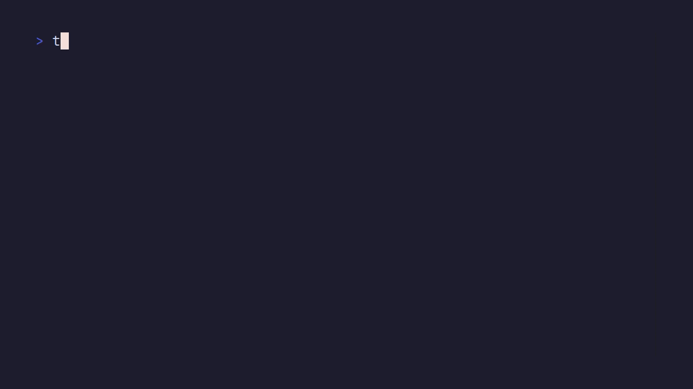

# Terdle

A [Wordle](https://www.nytimes.com/games/wordle/index.html) clone that runs in the terminal.

## Play

### Prerequisites
- [Go](https://go.dev)
- [VHS](https://github.com/charmbracelet/vhs) (optional, for creating the demo.gif file)

### Steps

1. Clone the repo
2. Go to the repo folder
3. Run `go run .`
4. Optionally, build it using `go build` and move the binary to wherever your binaries are stored.

